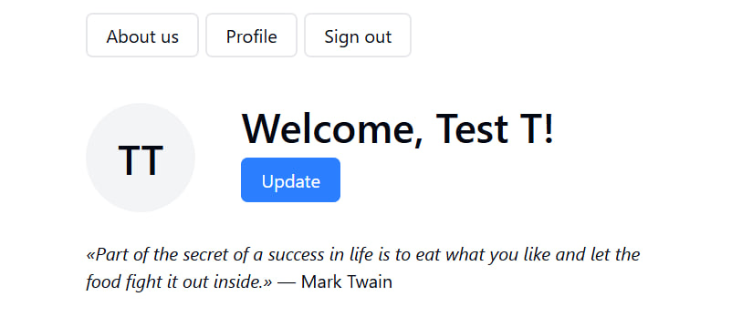
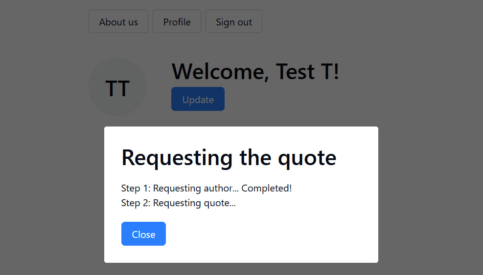
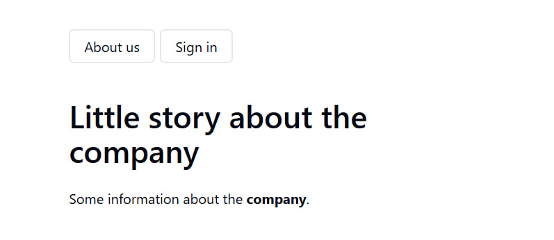

# Приложение-генератор случайных цитат





1. Вход в приложение. Для входа можно использовать:
   `Email: test@test.ru Пароль: qwe123`
2. После авторизации появляется доступ к профилю пользователя.
3. По кнопке "Update" идет запрос имитирующий цепочку асинхронных запросов к серверу.
4. Процесс и результаты запросов отображаются в модальном окне.
5. Пользователь имеет возможность остановить процесс, не дожидаясь завешрения.

## Для этого я использовала:

- Сборка на Vite
- React + TS
- React Hook Form + yup
- Mock Service Worker
- custom hooks

[🔗 Ссылка на демо приложения](https://quote-generator.yhub.net/)

## Как изучить проект локально:

- установка зависимостей

```js
npm install
```

- запуск на лайв-сервере

```js
npm run dev
```
